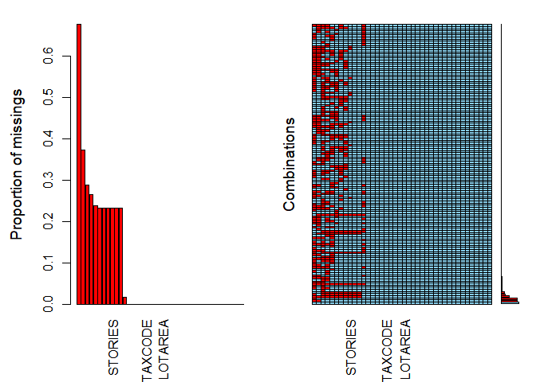
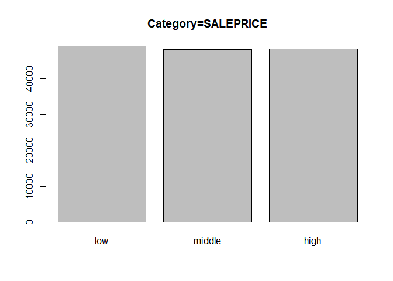
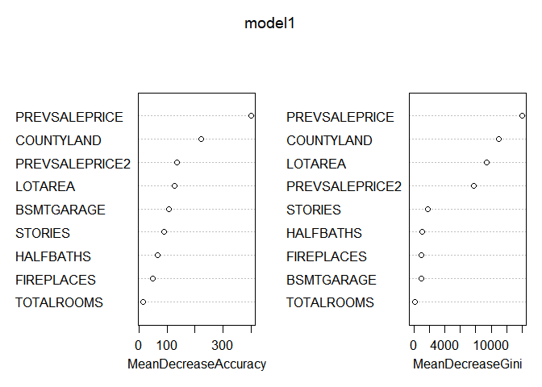

Capstone Project
================
Richar Martinez Castrillon - Student ID:500930115

Packages used in the project.
=============================

install.packages("rpart")
=========================

install.packages("caret")
=========================

install.packages("e1071")
=========================

install.packages("gplots")
==========================

install.packages("dplyr")
=========================

install.packages("devtools")
============================

install.packages("randomForest")
================================

``` r
library("gplots")
```

    ## Warning: package 'gplots' was built under R version 3.5.3

    ## 
    ## Attaching package: 'gplots'

    ## The following object is masked from 'package:stats':
    ## 
    ##     lowess

``` r
library(rpart)
```

    ## Warning: package 'rpart' was built under R version 3.5.3

``` r
library(caret)
```

    ## Warning: package 'caret' was built under R version 3.5.3

    ## Loading required package: lattice

    ## Loading required package: ggplot2

    ## Warning: package 'ggplot2' was built under R version 3.5.3

``` r
library(e1071)
```

    ## Warning: package 'e1071' was built under R version 3.5.3

``` r
library("randomForest")
```

    ## Warning: package 'randomForest' was built under R version 3.5.3

    ## randomForest 4.6-14

    ## Type rfNews() to see new features/changes/bug fixes.

    ## 
    ## Attaching package: 'randomForest'

    ## The following object is masked from 'package:ggplot2':
    ## 
    ##     margin

``` r
library("devtools")
```

    ## Warning: package 'devtools' was built under R version 3.5.3

    ## Loading required package: usethis

    ## Warning: package 'usethis' was built under R version 3.5.3

``` r
library("tidyverse")
```

    ## Warning: package 'tidyverse' was built under R version 3.5.3

    ## -- Attaching packages ------------------------------------------------- tidyverse 1.2.1 --

    ## v tibble  2.1.3     v purrr   0.2.5
    ## v tidyr   1.0.0     v dplyr   0.8.3
    ## v readr   1.3.1     v stringr 1.3.1
    ## v tibble  2.1.3     v forcats 0.4.0

    ## Warning: package 'tibble' was built under R version 3.5.3

    ## Warning: package 'tidyr' was built under R version 3.5.3

    ## Warning: package 'readr' was built under R version 3.5.3

    ## Warning: package 'dplyr' was built under R version 3.5.3

    ## Warning: package 'forcats' was built under R version 3.5.3

    ## -- Conflicts ---------------------------------------------------- tidyverse_conflicts() --
    ## x dplyr::combine()       masks randomForest::combine()
    ## x dplyr::filter()        masks stats::filter()
    ## x dplyr::lag()           masks stats::lag()
    ## x purrr::lift()          masks caret::lift()
    ## x randomForest::margin() masks ggplot2::margin()

``` r
library("VIM")
```

    ## Warning: package 'VIM' was built under R version 3.5.3

    ## Loading required package: colorspace

    ## Loading required package: grid

    ## Loading required package: data.table

    ## Warning: package 'data.table' was built under R version 3.5.3

    ## 
    ## Attaching package: 'data.table'

    ## The following objects are masked from 'package:dplyr':
    ## 
    ##     between, first, last

    ## The following object is masked from 'package:purrr':
    ## 
    ##     transpose

    ## VIM is ready to use. 
    ##  Since version 4.0.0 the GUI is in its own package VIMGUI.
    ## 
    ##           Please use the package to use the new (and old) GUI.

    ## Suggestions and bug-reports can be submitted at: https://github.com/alexkowa/VIM/issues

    ## 
    ## Attaching package: 'VIM'

    ## The following object is masked from 'package:datasets':
    ## 
    ##     sleep

``` r
library(dplyr)
library("party")
```

    ## Warning: package 'party' was built under R version 3.5.3

    ## Loading required package: mvtnorm

    ## Warning: package 'mvtnorm' was built under R version 3.5.3

    ## Loading required package: modeltools

    ## Warning: package 'modeltools' was built under R version 3.5.2

    ## Loading required package: stats4

    ## Loading required package: strucchange

    ## Warning: package 'strucchange' was built under R version 3.5.3

    ## Loading required package: zoo

    ## 
    ## Attaching package: 'zoo'

    ## The following objects are masked from 'package:base':
    ## 
    ##     as.Date, as.Date.numeric

    ## Loading required package: sandwich

    ## 
    ## Attaching package: 'strucchange'

    ## The following object is masked from 'package:stringr':
    ## 
    ##     boundary

``` r
library("rpart")
```

2.Data exploration.
===================

2.1 Load Dataset.
=================

``` r
data<- read.csv(choose.files(), sep = ",")
```

2.2 Structure of Data, Head and Tail.

``` r
str(data)
```

    ## 'data.frame':    579186 obs. of  86 variables:
    ##  $ PARID               : Factor w/ 579186 levels "0001A00100000000",..: 535 537 538 539 540 541 542 544 545 546 ...
    ##  $ PROPERTYHOUSENUM    : int  105 111 113 0 0 120 116 108 100 60 ...
    ##  $ PROPERTYFRACTION    : Factor w/ 2737 levels "-0.611","-1",..: 2527 2527 2527 2527 2527 2527 2527 2527 2527 2527 ...
    ##  $ PROPERTYADDRESS     : Factor w/ 16187 levels " ","1-279 ","10TH AVE",..: 8826 8826 8826 1468 1468 1468 1468 1468 1468 1469 ...
    ##  $ PROPERTYCITY        : Factor w/ 102 levels "","ALLISON PARK",..: 73 73 73 73 73 73 73 73 73 73 ...
    ##  $ PROPERTYSTATE       : Factor w/ 1 level "PA": 1 1 1 1 1 1 1 1 1 1 ...
    ##  $ PROPERTYUNIT        : Factor w/ 2357 levels " "," #1"," #2",..: 1 1 1 1 1 1 1 1 1 1 ...
    ##  $ PROPERTYZIP         : int  15222 15222 15222 15222 15222 15222 15222 15222 15222 15222 ...
    ##  $ MUNICODE            : int  101 101 101 101 101 101 101 101 101 101 ...
    ##  $ MUNIDESC            : Factor w/ 175 levels "10th Ward -  McKEESPORT",..: 17 17 17 17 17 17 17 17 17 17 ...
    ##  $ SCHOOLCODE          : int  47 47 47 47 47 47 47 47 47 47 ...
    ##  $ SCHOOLDESC          : Factor w/ 46 levels "Allegheny Valley",..: 31 31 31 31 31 31 31 31 31 31 ...
    ##  $ LEGAL1              : Factor w/ 523865 levels "","'219 A LAND CRAWFORD ST                        ",..: 297839 289087 521037 406004 100997 295666 297963 100998 301822 149885 ...
    ##  $ LEGAL2              : Factor w/ 381065 levels "","''F' LOT = 37.4X129.49X35.59 (.1084 A LD)      ",..: 1 1 342785 1 1 298590 1 1 1 37271 ...
    ##  $ LEGAL3              : Factor w/ 253245 levels "","' 619 FORELAND'",..: 1 1 1 1 1 1 1 1 1 1 ...
    ##  $ NEIGHCODE           : Factor w/ 1000 levels "10101","10201",..: 110 110 110 110 110 110 110 110 109 109 ...
    ##  $ NEIGHDESC           : Factor w/ 563 levels "","1000 GRANDVIEW",..: 433 433 433 433 433 433 433 433 433 433 ...
    ##  $ TAXCODE             : Factor w/ 3 levels "E","P","T": 3 3 3 3 3 3 3 3 3 3 ...
    ##  $ TAXDESC             : Factor w/ 3 levels "10 - Exempt",..: 3 3 3 3 3 3 3 3 3 3 ...
    ##  $ TAXSUBCODE          : Factor w/ 3 levels "","E","T": 1 1 1 1 1 1 1 1 1 1 ...
    ##  $ TAXSUBCODE_DESC     : Factor w/ 3 levels "","PURTA - Exempt",..: 1 1 1 1 1 1 1 1 1 1 ...
    ##  $ OWNERCODE           : int  20 10 20 20 20 20 20 20 20 20 ...
    ##  $ OWNERDESC           : Factor w/ 10 levels "CORPORATION",..: 1 5 1 1 1 1 1 1 1 1 ...
    ##  $ CLASS               : Factor w/ 7 levels "C","F","G","I",..: 1 1 1 1 1 1 1 1 1 1 ...
    ##  $ CLASSDESC           : Factor w/ 7 levels "AGRICULTURAL",..: 2 2 2 2 2 2 2 2 2 2 ...
    ##  $ USECODE             : int  449 406 456 499 499 448 447 456 499 449 ...
    ##  $ USEDESC             : Factor w/ 178 levels "",">10 ACRES VACANT",..: 116 152 136 30 30 117 118 136 30 116 ...
    ##  $ LOTAREA             : num  4900 3220 2380 4200 11200 ...
    ##  $ HOMESTEADFLAG       : Factor w/ 2 levels "","HOM": 1 1 1 1 1 1 1 1 1 1 ...
    ##  $ FARMSTEADFLAG       : Factor w/ 2 levels "","FRM": 1 1 1 1 1 1 1 1 1 1 ...
    ##  $ CLEANGREEN          : Factor w/ 2 levels "","Y": 1 1 1 1 1 1 1 1 1 1 ...
    ##  $ ABATEMENTFLAG       : Factor w/ 2 levels "","Y": 1 1 1 1 1 1 1 1 1 1 ...
    ##  $ RECORDDATE          : Factor w/ 5586 levels "","01-01-1971",..: 3269 1 5567 1 1 3763 2938 1041 4834 1 ...
    ##  $ SALEDATE            : Factor w/ 26771 levels "","01-01-1819",..: 15711 18119 23239 25718 25718 17934 13171 5034 23315 16438 ...
    ##  $ SALEPRICE           : int  500000 1 10 412500 412500 1400000 595000 400000 1 10 ...
    ##  $ SALECODE            : Factor w/ 82 levels ""," U","0","0N",..: 22 18 51 35 34 23 22 3 22 18 ...
    ##  $ SALEDESC            : Factor w/ 29 levels "","BANK SALE",..: 5 12 13 18 17 24 5 29 5 12 ...
    ##  $ DEEDBOOK            : Factor w/ 17706 levels ""," OC 2459",..: 6358 15901 7432 16249 16249 7285 8118 3571 6072 16676 ...
    ##  $ DEEDPAGE            : Factor w/ 1515 levels "","-33","`27",..: 622 597 563 669 669 845 502 142 295 768 ...
    ##  $ PREVSALEDATE        : Factor w/ 21455 levels "","01-01-1881",..: 8926 1 14944 1 1 17940 5007 5110 2094 1 ...
    ##  $ PREVSALEPRICE       : int  470000 NA 1 NA NA 1350000 260000 25000 206549 NA ...
    ##  $ PREVSALEDATE2       : Factor w/ 18205 levels "","01-01-1891",..: 17414 1 17979 1 1 7713 1 1 1 1 ...
    ##  $ PREVSALEPRICE2      : int  225000 NA 50000 NA NA 340000 NA NA NA NA ...
    ##  $ CHANGENOTICEADDRESS1: Factor w/ 395547 levels " -      ","       ",..: 153852 34251 139181 33669 33669 141319 375110 360749 6271 326541 ...
    ##  $ CHANGENOTICEADDRESS2: Factor w/ 1134 levels " -C/O CENTER FORFAMILY EXCELLENCE INC--DAVID RICHARDSON ",..: 2 2 2 2 2 2 2 2 2 2 ...
    ##  $ CHANGENOTICEADDRESS3: Factor w/ 4263 levels "   ","   M1K 3V4",..: 4004 3047 3047 3047 3047 3047 1177 3047 3047 3047 ...
    ##  $ CHANGENOTICEADDRESS4: Factor w/ 5857 levels "","10000","10001",..: 475 536 536 536 536 536 490 519 536 536 ...
    ##  $ COUNTYBUILDING      : int  533000 136200 2200 1900 4700 836800 147100 3800 3000 3631500 ...
    ##  $ COUNTYLAND          : int  196000 128800 190400 84000 448000 422400 217600 216200 192000 2500000 ...
    ##  $ COUNTYTOTAL         : int  729000 265000 192600 85900 452700 1259200 364700 220000 195000 6131500 ...
    ##  $ COUNTYEXEMPTBLDG    : int  0 0 0 0 0 0 0 0 0 0 ...
    ##  $ LOCALBUILDING       : int  533000 136200 2200 1900 4700 836800 147100 3800 3000 3631500 ...
    ##  $ LOCALLAND           : int  196000 128800 190400 84000 448000 422400 217600 216200 192000 2500000 ...
    ##  $ LOCALTOTAL          : int  729000 265000 192600 85900 452700 1259200 364700 220000 195000 6131500 ...
    ##  $ FAIRMARKETBUILDING  : int  533000 136200 2200 1900 4700 836800 147100 3800 3000 3631500 ...
    ##  $ FAIRMARKETLAND      : int  196000 128800 190400 84000 448000 422400 217600 216200 192000 2500000 ...
    ##  $ FAIRMARKETTOTAL     : int  729000 265000 192600 85900 452700 1259200 364700 220000 195000 6131500 ...
    ##  $ STYLE               : Factor w/ 30 levels "","1","10","11",..: 1 1 1 1 1 1 1 1 1 1 ...
    ##  $ STYLEDESC           : Factor w/ 29 levels "","BI-LEVEL",..: 1 1 1 1 1 1 1 1 1 1 ...
    ##  $ STORIES             : num  NA NA NA NA NA NA NA NA NA NA ...
    ##  $ YEARBLT             : int  NA NA NA NA NA NA NA NA NA NA ...
    ##  $ EXTERIORFINISH      : int  NA NA NA NA NA NA NA NA NA NA ...
    ##  $ EXTFINISH_DESC      : Factor w/ 9 levels "","Brick","Concrete",..: 1 1 1 1 1 1 1 1 1 1 ...
    ##  $ ROOF                : int  NA NA NA NA NA NA NA NA NA NA ...
    ##  $ ROOFDESC            : Factor w/ 7 levels "","METAL","ROLL",..: 1 1 1 1 1 1 1 1 1 1 ...
    ##  $ BASEMENT            : int  NA NA NA NA NA NA NA NA NA NA ...
    ##  $ BASEMENTDESC        : Factor w/ 6 levels "","Crawl","Full",..: 1 1 1 1 1 1 1 1 1 1 ...
    ##  $ GRADE               : Factor w/ 22 levels "","A","A-","A+",..: 1 1 1 1 1 1 1 1 1 1 ...
    ##  $ GRADEDESC           : Factor w/ 22 levels "","AVERAGE","AVERAGE -",..: 1 1 1 1 1 1 1 1 1 1 ...
    ##  $ CONDITION           : int  NA NA NA NA NA NA NA NA NA NA ...
    ##  $ CONDITIONDESC       : Factor w/ 9 levels "","AVERAGE","EXCELLENT",..: 1 1 1 1 1 1 1 1 1 1 ...
    ##  $ CDU                 : Factor w/ 9 levels "","AV","EX","FR",..: 1 1 1 1 1 1 1 1 1 1 ...
    ##  $ CDUDESC             : Factor w/ 9 levels "","AVERAGE","EXCELLENT",..: 1 1 1 1 1 1 1 1 1 1 ...
    ##  $ TOTALROOMS          : int  NA NA NA NA NA NA NA NA NA NA ...
    ##  $ BEDROOMS            : int  NA NA NA NA NA NA NA NA NA NA ...
    ##  $ FULLBATHS           : int  NA NA NA NA NA NA NA NA NA NA ...
    ##  $ HALFBATHS           : int  NA NA NA NA NA NA NA NA NA NA ...
    ##  $ HEATINGCOOLING      : Factor w/ 17 levels "","1","2","3",..: 1 1 1 1 1 1 1 1 1 1 ...
    ##  $ HEATINGCOOLINGDESC  : Factor w/ 16 levels "","Central Heat",..: 1 1 1 1 1 1 1 1 1 1 ...
    ##  $ FIREPLACES          : int  NA NA NA NA NA NA NA NA NA NA ...
    ##  $ BSMTGARAGE          : int  NA NA NA NA NA NA NA NA NA NA ...
    ##  $ FINISHEDLIVINGAREA  : int  NA NA NA NA NA NA NA NA NA NA ...
    ##  $ CARDNUMBER          : int  NA NA NA NA NA NA NA NA NA NA ...
    ##  $ ALT_ID              : Factor w/ 26161 levels "","0015M00076000001",..: 1 1 1 1 1 1 1 1 1 1 ...
    ##  $ TAXYEAR             : int  2019 2019 2019 2019 2019 2019 2019 2019 2019 2019 ...
    ##  $ ASOFDATE            : Factor w/ 1 level "01-Aug-19": 1 1 1 1 1 1 1 1 1 1 ...

``` r
head(data)
```

    ##              PARID PROPERTYHOUSENUM PROPERTYFRACTION     PROPERTYADDRESS
    ## 1 0001G00114000000              105                            MARKET ST
    ## 2 0001G00117000000              111                            MARKET ST
    ## 3 0001G00118000000              113                            MARKET ST
    ## 4 0001G00120000000                0                  BLVD OF THE ALLIES 
    ## 5 0001G00123000000                0                  BLVD OF THE ALLIES 
    ## 6 0001G00125000000              120                  BLVD OF THE ALLIES 
    ##   PROPERTYCITY PROPERTYSTATE PROPERTYUNIT PROPERTYZIP MUNICODE
    ## 1   PITTSBURGH            PA                    15222      101
    ## 2   PITTSBURGH            PA                    15222      101
    ## 3   PITTSBURGH            PA                    15222      101
    ## 4   PITTSBURGH            PA                    15222      101
    ## 5   PITTSBURGH            PA                    15222      101
    ## 6   PITTSBURGH            PA                    15222      101
    ##                 MUNIDESC SCHOOLCODE SCHOOLDESC
    ## 1 1st Ward  - PITTSBURGH         47 Pittsburgh
    ## 2 1st Ward  - PITTSBURGH         47 Pittsburgh
    ## 3 1st Ward  - PITTSBURGH         47 Pittsburgh
    ## 4 1st Ward  - PITTSBURGH         47 Pittsburgh
    ## 5 1st Ward  - PITTSBURGH         47 Pittsburgh
    ## 6 1st Ward  - PITTSBURGH         47 Pittsburgh
    ##                                            LEGAL1
    ## 1                                    LOT 34.96X70
    ## 2                                    LOT 23X70.24
    ## 3 WOODS PLAN PT 227-228 LOT 34.06X70.24 IN ALL MA
    ## 4                             PT 229 LOT 35.12X60
    ## 5          COL WOODS PLAN 231 PT 230 LOT 70.36X80
    ## 6                                       LOT 30X80
    ##                        LEGAL2 LEGAL3 NEIGHCODE        NEIGHDESC TAXCODE
    ## 1                                        51C02 PITTSBURGH URBAN       T
    ## 2                                        51C02 PITTSBURGH URBAN       T
    ## 3 RKET ST S W COR BLVD-ALLIES            51C02 PITTSBURGH URBAN       T
    ## 4                                        51C02 PITTSBURGH URBAN       T
    ## 5                                        51C02 PITTSBURGH URBAN       T
    ## 6             LOT 35.65X80.20            51C02 PITTSBURGH URBAN       T
    ##        TAXDESC TAXSUBCODE TAXSUBCODE_DESC OWNERCODE   OWNERDESC CLASS
    ## 1 20 - Taxable                                   20 CORPORATION     C
    ## 2 20 - Taxable                                   10     REGULAR     C
    ## 3 20 - Taxable                                   20 CORPORATION     C
    ## 4 20 - Taxable                                   20 CORPORATION     C
    ## 5 20 - Taxable                                   20 CORPORATION     C
    ## 6 20 - Taxable                                   20 CORPORATION     C
    ##    CLASSDESC USECODE                      USEDESC LOTAREA HOMESTEADFLAG
    ## 1 COMMERCIAL     449 OFFICE-ELEVATOR -3 + STORIES    4900              
    ## 2 COMMERCIAL     406               RETL/STOR OVER    3220              
    ## 3 COMMERCIAL     456          PARKING GARAGE/LOTS    2380              
    ## 4 COMMERCIAL     499            COMM AUX BUILDING    4200              
    ## 5 COMMERCIAL     499            COMM AUX BUILDING   11200              
    ## 6 COMMERCIAL     448   OFFICE-WALKUP -3 + STORIES   10560              
    ##   FARMSTEADFLAG CLEANGREEN ABATEMENTFLAG RECORDDATE   SALEDATE SALEPRICE
    ## 1                                        08-01-2014 08-01-2014    500000
    ## 2                                                   09-03-1992         1
    ## 3                                        12-30-2016 11-11-2016        10
    ## 4                                                   12-16-1993    412500
    ## 5                                                   12-16-1993    412500
    ## 6                                        09-02-2016 08-31-2016   1400000
    ##   SALECODE                  SALEDESC DEEDBOOK DEEDPAGE PREVSALEDATE
    ## 1       35             CORP TRANSFER    15687      296   06-01-1998
    ## 2        3            LOVE&AFFECTION     8802      274             
    ## 3        H           MULTI-PARCEL SA    16656       25   09-10-2009
    ## 4        9             OTHER INVALID     9120      327             
    ## 5        8                     OTHER     9120      327             
    ## 6       36 QUIT CLAIM / SPEC WARRNTY    16524      451   10-30-2009
    ##   PREVSALEPRICE PREVSALEDATE2 PREVSALEPRICE2         CHANGENOTICEADDRESS1
    ## 1        470000    12-14-1995         225000        2140   WOODLAND RD   
    ## 2            NA                           NA           111   MARKET ST   
    ## 3             1    12-27-1991          50000  2020   SMALLMAN ST  STE 301
    ## 4            NA                           NA 111   BLVD OF THE ALLIES    
    ## 5            NA                           NA 111   BLVD OF THE ALLIES    
    ## 6       1350000    06-05-1998         340000     204   FIFTH AVE  STE 404
    ##   CHANGENOTICEADDRESS2 CHANGENOTICEADDRESS3 CHANGENOTICEADDRESS4
    ## 1                           WARRENDALE PA                  15086
    ## 2                           PITTSBURGH PA                  15222
    ## 3                           PITTSBURGH PA                  15222
    ## 4                           PITTSBURGH PA                  15222
    ## 5                           PITTSBURGH PA                  15222
    ## 6                           PITTSBURGH PA                  15222
    ##   COUNTYBUILDING COUNTYLAND COUNTYTOTAL COUNTYEXEMPTBLDG LOCALBUILDING
    ## 1         533000     196000      729000                0        533000
    ## 2         136200     128800      265000                0        136200
    ## 3           2200     190400      192600                0          2200
    ## 4           1900      84000       85900                0          1900
    ## 5           4700     448000      452700                0          4700
    ## 6         836800     422400     1259200                0        836800
    ##   LOCALLAND LOCALTOTAL FAIRMARKETBUILDING FAIRMARKETLAND FAIRMARKETTOTAL
    ## 1    196000     729000             533000         196000          729000
    ## 2    128800     265000             136200         128800          265000
    ## 3    190400     192600               2200         190400          192600
    ## 4     84000      85900               1900          84000           85900
    ## 5    448000     452700               4700         448000          452700
    ## 6    422400    1259200             836800         422400         1259200
    ##   STYLE STYLEDESC STORIES YEARBLT EXTERIORFINISH EXTFINISH_DESC ROOF
    ## 1                      NA      NA             NA                  NA
    ## 2                      NA      NA             NA                  NA
    ## 3                      NA      NA             NA                  NA
    ## 4                      NA      NA             NA                  NA
    ## 5                      NA      NA             NA                  NA
    ## 6                      NA      NA             NA                  NA
    ##   ROOFDESC BASEMENT BASEMENTDESC GRADE GRADEDESC CONDITION CONDITIONDESC
    ## 1                NA                                     NA              
    ## 2                NA                                     NA              
    ## 3                NA                                     NA              
    ## 4                NA                                     NA              
    ## 5                NA                                     NA              
    ## 6                NA                                     NA              
    ##   CDU CDUDESC TOTALROOMS BEDROOMS FULLBATHS HALFBATHS HEATINGCOOLING
    ## 1                     NA       NA        NA        NA               
    ## 2                     NA       NA        NA        NA               
    ## 3                     NA       NA        NA        NA               
    ## 4                     NA       NA        NA        NA               
    ## 5                     NA       NA        NA        NA               
    ## 6                     NA       NA        NA        NA               
    ##   HEATINGCOOLINGDESC FIREPLACES BSMTGARAGE FINISHEDLIVINGAREA CARDNUMBER
    ## 1                            NA         NA                 NA         NA
    ## 2                            NA         NA                 NA         NA
    ## 3                            NA         NA                 NA         NA
    ## 4                            NA         NA                 NA         NA
    ## 5                            NA         NA                 NA         NA
    ## 6                            NA         NA                 NA         NA
    ##   ALT_ID TAXYEAR  ASOFDATE
    ## 1           2019 01-Aug-19
    ## 2           2019 01-Aug-19
    ## 3           2019 01-Aug-19
    ## 4           2019 01-Aug-19
    ## 5           2019 01-Aug-19
    ## 6           2019 01-Aug-19

``` r
tail(data)
```

    ##                   PARID PROPERTYHOUSENUM PROPERTYFRACTION PROPERTYADDRESS
    ## 579181 0061R00048000000             2123                        WHITED ST
    ## 579182 0184N00093000000             5746                    INTERBORO AVE
    ## 579183 0184N00197000000             5743                        LAUDER ST
    ## 579184 0061H00157000000             1537                     BALLINGER ST
    ## 579185 0184P00083000000             5616                         KEEFE ST
    ## 579186 0381F00366000000             1418                      HAMILTON ST
    ##        PROPERTYCITY PROPERTYSTATE PROPERTYUNIT PROPERTYZIP MUNICODE
    ## 579181   PITTSBURGH            PA                    15210      132
    ## 579182   PITTSBURGH            PA                    15207      131
    ## 579183   PITTSBURGH            PA                    15207      131
    ## 579184   PITTSBURGH            PA                    15210      132
    ## 579185   PITTSBURGH            PA                    15207      131
    ## 579186  MC KEESPORT            PA                    15132      407
    ##                      MUNIDESC SCHOOLCODE      SCHOOLDESC
    ## 579181 32nd Ward - PITTSBURGH         47      Pittsburgh
    ## 579182 31st Ward - PITTSBURGH         47      Pittsburgh
    ## 579183 31st Ward - PITTSBURGH         47      Pittsburgh
    ## 579184 32nd Ward - PITTSBURGH         47      Pittsburgh
    ## 579185 31st Ward - PITTSBURGH         47      Pittsburgh
    ## 579186 7th Ward  - McKEESPORT         23 McKeesport Area
    ##                                                 LEGAL1
    ## 579181                          BAILEY & MOON 2ND PLAN
    ## 579182 LINCOLN PL PLAN 682-683-684 LOT 122.98X130X60.6
    ## 579183 LINCOLN PL PLAN 652 LOT 25X120 LAUDER AVE      
    ## 579184   BAILEY & MOON PLAN 24 LOT 50X200 BALLINGER ST
    ## 579185 LINCOLN PL PLAN 804-805-806 LOT 75 X 110       
    ## 579186 STEWART PLAN 97 PT-96 LOT 32.35X110 IN ALL HAMI
    ##                                                 LEGAL2
    ## 579181       LOT 85-86 =  LOT 101.46X268.63X100X285.83
    ## 579182 4 RR IN ALL INTERBORO AVE                      
    ## 579183 1 STY FRA ALUM HSE-INT GAR REAR 5743           
    ## 579184                              1 STY BRK HSE 1537
    ## 579185 IN ALL KEEFE ST                                
    ## 579186 LTON AV COR STEWART ST                         
    ##                                                 LEGAL3 NEIGHCODE
    ## 579181 1 1/2 STY FRA-ALUM SDG HSE- INT GAR 2123            13202
    ## 579182 2 STY ALUM HSE #5746                                13102
    ## 579183                                                     13102
    ## 579184                                                     13201
    ## 579185 2 STY BRK HSE & GAR 5616                            13102
    ## 579186 2 STY FRA HSE #1418                                 40008
    ##                 NEIGHDESC TAXCODE      TAXDESC TAXSUBCODE TAXSUBCODE_DESC
    ## 579181              13202       T 20 - Taxable                           
    ## 579182              13102       T 20 - Taxable                           
    ## 579183              13102       T 20 - Taxable                           
    ## 579184              13201       T 20 - Taxable                           
    ## 579185              13102       T 20 - Taxable                           
    ## 579186 CITY OF MCKEESPORT       T 20 - Taxable                           
    ##        OWNERCODE              OWNERDESC CLASS   CLASSDESC USECODE
    ## 579181        20            CORPORATION     R RESIDENTIAL      10
    ## 579182        12 REGULAR-ETUX OR ET VIR     R RESIDENTIAL      10
    ## 579183        10                REGULAR     R RESIDENTIAL      10
    ## 579184        20            CORPORATION     R RESIDENTIAL      10
    ## 579185        10                REGULAR     R RESIDENTIAL      10
    ## 579186        10                REGULAR     R RESIDENTIAL      10
    ##              USEDESC LOTAREA HOMESTEADFLAG FARMSTEADFLAG CLEANGREEN
    ## 579181 SINGLE FAMILY   14382                                       
    ## 579182 SINGLE FAMILY   11935                                       
    ## 579183 SINGLE FAMILY    3001           HOM                         
    ## 579184 SINGLE FAMILY   10000                                       
    ## 579185 SINGLE FAMILY    8250           HOM                         
    ## 579186 SINGLE FAMILY    3559                                       
    ##        ABATEMENTFLAG RECORDDATE   SALEDATE SALEPRICE SALECODE
    ## 579181               04-19-2018 04-04-2018     85000        0
    ## 579182                          01-07-1980     35000        0
    ## 579183                          05-01-1991     19000        0
    ## 579184               12-15-2016 12-15-2016     50000       14
    ## 579185               01-10-2011 01-10-2011         0        3
    ## 579186               10-16-2017 09-29-2017      3250       99
    ##              SALEDESC DEEDBOOK DEEDPAGE PREVSALEDATE PREVSALEPRICE
    ## 579181     VALID SALE    17180      114   06-29-1994         45000
    ## 579182     VALID SALE                                           NA
    ## 579183     VALID SALE     8469      184                         NA
    ## 579184 TIME ON MARKET    16639      374   11-14-2005         50000
    ## 579185 LOVE&AFFECTION    14477      525   10-17-1979             0
    ## 579186 CORRECTN / DUP    16976      579   07-13-2017          6099
    ##        PREVSALEDATE2 PREVSALEPRICE2        CHANGENOTICEADDRESS1
    ## 579181                           NA 606   LIBERTY AVE  UNIT 107
    ## 579182                           NA     5746   INTERBORO AVE   
    ## 579183                           NA         5743   LAUDER ST   
    ## 579184    11-06-1995          38700        1550   PETUNIA ST   
    ## 579185                           NA          5616   KEEFE ST   
    ## 579186    02-25-2002          53000       1418   HAMILTON ST   
    ##        CHANGENOTICEADDRESS2 CHANGENOTICEADDRESS3 CHANGENOTICEADDRESS4
    ## 579181           3RD FLOOR       PITTSBURGH PA                  15222
    ## 579182                           PITTSBURGH PA                  15207
    ## 579183                           PITTSBURGH PA                  15207
    ## 579184                           PITTSBURGH PA                  15210
    ## 579185                           PITTSBURGH PA                  15207
    ## 579186                          MC KEESPORT PA                  15132
    ##        COUNTYBUILDING COUNTYLAND COUNTYTOTAL COUNTYEXEMPTBLDG
    ## 579181          34900      30800       65700                0
    ## 579182          64500      12600       77100                0
    ## 579183          19700       9600       29300                0
    ## 579184          35200      23500       58700                0
    ## 579185          52500      12300       64800                0
    ## 579186           5000       4300        9300                0
    ##        LOCALBUILDING LOCALLAND LOCALTOTAL FAIRMARKETBUILDING
    ## 579181         34900     30800      65700              34900
    ## 579182         64500     12600      77100              64500
    ## 579183         37700      9600      47300              37700
    ## 579184         35200     23500      58700              35200
    ## 579185         70500     12300      82800              70500
    ## 579186          5000      4300       9300               5000
    ##        FAIRMARKETLAND FAIRMARKETTOTAL STYLE STYLEDESC STORIES YEARBLT
    ## 579181          30800           65700     5  CAPE COD     1.5    1933
    ## 579182          12600           77100    16 OLD STYLE     2.0    1927
    ## 579183           9600           47300    18  BUNGALOW     1.0    1951
    ## 579184          23500           58700     1     RANCH     1.0    1959
    ## 579185          12300           82800     4  COLONIAL     2.0    1956
    ## 579186           4300            9300    16 OLD STYLE     2.0    1910
    ##        EXTERIORFINISH EXTFINISH_DESC ROOF ROOFDESC BASEMENT BASEMENTDESC
    ## 579181              1          Frame    1  SHINGLE        5         Full
    ## 579182              1          Frame    1  SHINGLE        5         Full
    ## 579183              1          Frame    1  SHINGLE        5         Full
    ## 579184              2          Brick    1  SHINGLE        5         Full
    ## 579185              2          Brick    1  SHINGLE        5         Full
    ## 579186              1          Frame    1  SHINGLE        5         Full
    ##        GRADE       GRADEDESC CONDITION CONDITIONDESC CDU   CDUDESC
    ## 579181    C-       AVERAGE -         3       AVERAGE  AV   AVERAGE
    ## 579182     C         AVERAGE         3       AVERAGE  AV   AVERAGE
    ## 579183    D+ BELOW AVERAGE +         3       AVERAGE  AV   AVERAGE
    ## 579184    C-       AVERAGE -         3       AVERAGE  FR      FAIR
    ## 579185     C         AVERAGE         3       AVERAGE  AV   AVERAGE
    ## 579186    D+ BELOW AVERAGE +         5          POOR  VP VERY POOR
    ##        TOTALROOMS BEDROOMS FULLBATHS HALFBATHS HEATINGCOOLING
    ## 579181          5        2         1         0              2
    ## 579182          6        3         1         0              2
    ## 579183          3        1         1         0              2
    ## 579184          5        2         1         0              2
    ## 579185          6        3         1         0              2
    ## 579186          6        3         1         0              2
    ##        HEATINGCOOLINGDESC FIREPLACES BSMTGARAGE FINISHEDLIVINGAREA
    ## 579181       Central Heat          0          1               1164
    ## 579182       Central Heat          0          0               1628
    ## 579183       Central Heat          0          1                864
    ## 579184       Central Heat          0          0                775
    ## 579185       Central Heat          0          1               1400
    ## 579186       Central Heat          0          0               1656
    ##        CARDNUMBER ALT_ID TAXYEAR  ASOFDATE
    ## 579181          1           2019 01-Aug-19
    ## 579182          1           2019 01-Aug-19
    ## 579183          1           2019 01-Aug-19
    ## 579184          1           2019 01-Aug-19
    ## 579185          1           2019 01-Aug-19
    ## 579186          1           2019 01-Aug-19

2.3 Summary of Data
===================

``` r
summary(data)
```

    ##               PARID        PROPERTYHOUSENUM PROPERTYFRACTION
    ##  0001A00100000000:     1   Min.   :    0           :571544  
    ##  0001B00010000000:     1   1st Qu.:  122     1/2   :   816  
    ##  0001B00024000000:     1   Median :  521     A     :   388  
    ##  0001B00026000000:     1   Mean   : 1378     B     :   249  
    ##  0001B00050000000:     1   3rd Qu.: 1717     C     :    36  
    ##  0001C00037000000:     1   Max.   :39392     -1/2  :    30  
    ##  (Other)         :579180   NA's   :71       (Other):  6123  
    ##       PROPERTYADDRESS          PROPERTYCITY    PROPERTYSTATE
    ##  5TH AVE      :  2034   PITTSBURGH   :309069   PA:579186    
    ##  MAIN ST      :  1436   MC KEESPORT  : 22115                
    ##  PENN AVE     :  1405   CORAOPOLIS   : 17593                
    ##  GRANDVIEW AVE:  1349   GIBSONIA     : 12752                
    ##  WALNUT ST    :  1343   BETHEL PARK  : 12162                
    ##  LINCOLN AVE  :  1204   MC KEES ROCKS: 11550                
    ##  (Other)      :570415   (Other)      :193945                
    ##    PROPERTYUNIT     PROPERTYZIP       MUNICODE    
    ##          :571589   Min.   :15003   Min.   :101.0  
    ##  UNIT 1  :    91   1st Qu.:15108   1st Qu.:202.0  
    ##  UNIT 3  :    89   Median :15204   Median :872.0  
    ##  UNIT 2  :    88   Mean   :15167   Mean   :683.3  
    ##  UNIT 201:    84   3rd Qu.:15221   3rd Qu.:926.0  
    ##  UNIT 301:    82   Max.   :16229   Max.   :953.0  
    ##  (Other) :  7163   NA's   :1                      
    ##                    MUNIDESC        SCHOOLCODE              SCHOOLDESC    
    ##  Penn Hills            : 20769   Min.   : 1.00   Pittsburgh     :143914  
    ##  Ross                  : 14604   1st Qu.:17.00   Woodland Hills : 24722  
    ##  19th Ward - PITTSBURGH: 14039   Median :29.00   North Allegheny: 21730  
    ##  Bethel Park           : 13185   Mean   :28.95   Penn Hills Twp : 20769  
    ##  Shaler                : 13066   3rd Qu.:46.00   Shaler Area    : 18548  
    ##  Mt.Lebanon            : 12014   Max.   :50.00   North Hills    : 17653  
    ##  (Other)               :491509                   (Other)        :331850  
    ##                                       LEGAL1      
    ##  CLOVERLEAF ESTATES WEST                 :   456  
    ##  REDWOOD ESTATES                         :   275  
    ##  VIRGINIA HILLS WEST                     :   270  
    ##  TRADITIONS OF AMERICA AT SEWICKLEY RIDGE:   252  
    ##  NEW WALL PLAN 2                         :   226  
    ##  VENANGO TRAIL PLAN OF LOTS              :   194  
    ##  (Other)                                 :577513  
    ##                                              LEGAL2      
    ##                                                 : 64444  
    ##  ST                                             :  2258  
    ##  TRAILER                                        :  2212  
    ##  T                                              :  2002  
    ##  DR                                             :  1907  
    ##  AVE                                            :  1879  
    ##  (Other)                                        :504484  
    ##                                              LEGAL3         NEIGHCODE     
    ##                                                 :241416   93401  :  9103  
    ##  C B GAR                                        :  1760   11903  :  6425  
    ##  FRA GAR                                        :  1394   93403  :  5992  
    ##  2 CAR C B GAR                                  :  1029   94004  :  5917  
    ##  1 CAR C B GAR                                  :   788   94402  :  5048  
    ##  1 STY BRK GAR                                  :   787   87603  :  4988  
    ##  (Other)                                        :332012   (Other):541713  
    ##                   NEIGHDESC      TAXCODE   
    ##  PENN HILLS TOWNSHIP   : 19693   E: 28726  
    ##  PITTSBURGH URBAN      : 15263   P:  1717  
    ##  81201                 : 12584   T:548743  
    ##  BETHEL PARK           : 11793             
    ##  MOUNT LEBANON TOWNSHIP: 10971             
    ##  PLUM BOROUGH          : 10667             
    ##  (Other)               :498215             
    ##                                    TAXDESC       TAXSUBCODE
    ##  10 - Exempt                           : 28726    :577469  
    ##  12 - Public Utility Realty Tax - PURTA:  1717   E:   680  
    ##  20 - Taxable                          :548743   T:  1037  
    ##                                                            
    ##                                                            
    ##                                                            
    ##                                                            
    ##         TAXSUBCODE_DESC     OWNERCODE                      OWNERDESC     
    ##                 :577469   Min.   :10.00   REGULAR               :245137  
    ##  PURTA - Exempt :   680   1st Qu.:10.00   REGULAR-ETUX OR ET VIR:204751  
    ##  PURTA - Taxable:  1037   Median :12.00   CORPORATION           : 97495  
    ##                           Mean   :12.45   REGULAR-ETAL          : 31291  
    ##                           3rd Qu.:12.00   CORPORATION-RAILROAD  :   409  
    ##                           Max.   :28.00   REGULAR-ESTATE        :    46  
    ##                                           (Other)               :    57  
    ##  CLASS             CLASSDESC         USECODE                 USEDESC      
    ##  C: 36304   AGRICULTURAL:  2423   Min.   :   1.00   SINGLE FAMILY:372491  
    ##  F:  2423   COMMERCIAL  : 36304   1st Qu.:  10.00   VACANT LAND  : 63650  
    ##  G: 17036   GOVERNMENT  : 17036   Median :  10.00   TWO FAMILY   : 17425  
    ##  I:  3703   INDUSTRIAL  :  3703   Mean   :  78.08   CONDOMINIUM  : 16768  
    ##  O:   774   OTHER       :   774   3rd Qu.:  70.00   TOWNHOUSE    : 15486  
    ##  R:516986   RESIDENTIAL :516986   Max.   :1111.00   ROWHOUSE     : 11261  
    ##  U:  1960   UTILITIES   :  1960                     (Other)      : 82105  
    ##     LOTAREA          HOMESTEADFLAG FARMSTEADFLAG CLEANGREEN ABATEMENTFLAG
    ##  Min.   :0.000e+00      :270788       :579180     :577508    :578610     
    ##  1st Qu.:3.200e+03   HOM:308398    FRM:     6    Y:  1678   Y:   576     
    ##  Median :6.820e+03                                                       
    ##  Mean   :4.082e+04                                                       
    ##  3rd Qu.:1.351e+04                                                       
    ##  Max.   :4.400e+09                                                       
    ##                                                                          
    ##       RECORDDATE           SALEDATE        SALEPRICE        
    ##            :249555             :  6813   Min.   :        0  
    ##  10-26-2012:   441   05-05-1950:  2596   1st Qu.:        1  
    ##  04-29-2016:   415   06-05-1950:   780   Median :    37900  
    ##  04-29-2010:   392   04-29-2016:   528   Mean   :   119646  
    ##  04-26-2013:   391   12-30-1948:   521   3rd Qu.:   123000  
    ##  01-11-2012:   350   10-26-2012:   439   Max.   :179395660  
    ##  (Other)   :327642   (Other)   :567509   NA's   :9168       
    ##     SALECODE                 SALEDESC         DEEDBOOK     
    ##  3      :133996   LOVE&AFFECTION :133996          : 53733  
    ##  0      :133692   VALID SALE     :133692   TR18   :  1618  
    ##  H      : 41206   OTHER VALID    : 49366   0      :  1474  
    ##  N      : 39615   MULTI-PARCEL SA: 41206   TR15   :  1043  
    ##  9      : 33651   NOT APPLICABLE : 39615   TR17   :   944  
    ##  U      : 29214   OTHER INVALID  : 33645   TR16   :   802  
    ##  (Other):167812   (Other)        :147666   (Other):519572  
    ##     DEEDPAGE          PREVSALEDATE    PREVSALEPRICE      
    ##         : 53930             :214071   Min.   :        0  
    ##  1      :  4377   05-05-1950: 19099   1st Qu.:        1  
    ##  0      :  1704   05-28-2009:   178   Median :    16000  
    ##  6      :  1249   05-11-2007:   162   Mean   :    92533  
    ##  17     :  1128   12-31-1986:   160   3rd Qu.:    86000  
    ##  464    :  1107   09-21-2012:   145   Max.   :292907832  
    ##  (Other):515691   (Other)   :345371   NA's   :215670     
    ##     PREVSALEDATE2    PREVSALEPRICE2    
    ##            :391537   Min.   :       0  
    ##  05-05-1950: 14297   1st Qu.:       1  
    ##  01-15-1993:   109   Median :   11500  
    ##  04-14-2005:   103   Mean   :   77487  
    ##  06-08-2006:    96   3rd Qu.:   77000  
    ##  09-05-2000:    89   Max.   :59002000  
    ##  (Other)   :172955   NA's   :392058    
    ##                    CHANGENOTICEADDRESS1             CHANGENOTICEADDRESS2
    ##  414   GRANT ST  RM 200      : 12656                          :562751   
    ##                              : 12283     CITY-COUNTY BUILDING : 12715   
    ##  200   ROSS ST  FL 10        :  1692     3RD FLOOR            :   757   
    ##  542   FORBES AVE  RM 347    :   773     PROPERTY TAX DEPT    :   339   
    ##  345   6TH AVE               :   757     FORBES PAVILLION     :   143   
    ##  112   WASHINGTON PL  STE 900:   705     REAL ESTATE DIVISION :    96   
    ##  (Other)                     :550320    (Other)               :  2385   
    ##            CHANGENOTICEADDRESS3 CHANGENOTICEADDRESS4 COUNTYBUILDING     
    ##  PITTSBURGH PA       :267488    15219  : 21216       Min.   :        0  
    ##  PITTSBURGH      PA  : 20782    15237  : 18807       1st Qu.:    14300  
    ##  MC KEESPORT PA      : 17906    15108  : 16723       Median :    51000  
    ##  CORAOPOLIS PA       : 15429    15235  : 16282       Mean   :   130581  
    ##                      : 12122    15236  : 12850       3rd Qu.:    99800  
    ##  GIBSONIA PA         : 10592    15102  : 12749       Max.   :598774700  
    ##  (Other)             :234867    (Other):480559                          
    ##    COUNTYLAND         COUNTYTOTAL        COUNTYEXEMPTBLDG   
    ##  Min.   :        0   Min.   :0.000e+00   Min.   :        0  
    ##  1st Qu.:     9300   1st Qu.:3.060e+04   1st Qu.:        0  
    ##  Median :    23100   Median :7.750e+04   Median :        0  
    ##  Mean   :    45282   Mean   :1.759e+05   Mean   :     3333  
    ##  3rd Qu.:    42600   3rd Qu.:1.420e+05   3rd Qu.:        0  
    ##  Max.   :928739500   Max.   :1.351e+09   Max.   :247710130  
    ##                                                             
    ##  LOCALBUILDING         LOCALLAND           LOCALTOTAL       
    ##  Min.   :        0   Min.   :        0   Min.   :0.000e+00  
    ##  1st Qu.:    22300   1st Qu.:     9485   1st Qu.:3.780e+04  
    ##  Median :    63100   Median :    23100   Median :8.960e+04  
    ##  Mean   :   140865   Mean   :    45333   Mean   :1.862e+05  
    ##  3rd Qu.:   112900   3rd Qu.:    42600   3rd Qu.:1.551e+05  
    ##  Max.   :598774700   Max.   :928739500   Max.   :1.351e+09  
    ##                                                             
    ##  FAIRMARKETBUILDING  FAIRMARKETLAND      FAIRMARKETTOTAL    
    ##  Min.   :        0   Min.   :        0   Min.   :0.000e+00  
    ##  1st Qu.:    22300   1st Qu.:     9700   1st Qu.:3.810e+04  
    ##  Median :    63200   Median :    23200   Median :8.980e+04  
    ##  Mean   :   143470   Mean   :    46072   Mean   :1.895e+05  
    ##  3rd Qu.:   113000   3rd Qu.:    43000   3rd Qu.:1.557e+05  
    ##  Max.   :598774700   Max.   :928739500   Max.   :1.351e+09  
    ##                                                             
    ##      STYLE               STYLEDESC         STORIES          YEARBLT      
    ##         :134429               :134429   Min.   :1.00     Min.   :1755    
    ##  16     :118190   OLD STYLE   :118190   1st Qu.:1.00     1st Qu.:1924    
    ##  4      : 91305   COLONIAL    : 91305   Median :2.00     Median :1950    
    ##  1      : 71940   RANCH       : 71940   Mean   :1.64     Mean   :1948    
    ##  5      : 39945   CAPE COD    : 39945   3rd Qu.:2.00     3rd Qu.:1968    
    ##  13     : 22434   MULTI-FAMILY: 22434   Max.   :4.00     Max.   :2019    
    ##  (Other):100943   (Other)     :100943   NA's   :134444   NA's   :134429  
    ##  EXTERIORFINISH         EXTFINISH_DESC        ROOF           ROOFDESC     
    ##  Min.   :1.00     Brick        :219979   Min.   :1.00            :135149  
    ##  1st Qu.:1.00     Frame        :161917   1st Qu.:1.00     METAL  :  1750  
    ##  Median :2.00                  :134505   Median :1.00     ROLL   : 18225  
    ##  Mean   :2.16     Masonry FRAME: 52659   Mean   :1.19     RUBBER :   182  
    ##  3rd Qu.:2.00     Stone        :  5166   3rd Qu.:1.00     SHINGLE:402655  
    ##  Max.   :8.00     Stucco       :  2321   Max.   :6.00     SLATE  : 19638  
    ##  NA's   :134505   (Other)      :  2639   NA's   :135149   TILE   :  1587  
    ##     BASEMENT          BASEMENTDESC        GRADE       
    ##  Min.   :1.00               :134560   C      :162765  
    ##  1st Qu.:5.00     Crawl     :  3607          :134439  
    ##  Median :5.00     Full      :403158   C-     : 85455  
    ##  Mean   :4.76     None      : 17567   C+     : 76332  
    ##  3rd Qu.:5.00     Part      : 16623   D+     : 39695  
    ##  Max.   :5.00     Slab/Piers:  3671   B-     : 18868  
    ##  NA's   :134560                       (Other): 61632  
    ##            GRADEDESC        CONDITION        CONDITIONDESC   
    ##  AVERAGE        :162765   Min.   :1.00     AVERAGE  :318307  
    ##                 :134439   1st Qu.:3.00              :134505  
    ##  AVERAGE -      : 85455   Median :3.00     FAIR     : 63687  
    ##  AVERAGE +      : 76332   Mean   :3.16     GOOD     : 43859  
    ##  BELOW AVERAGE +: 39695   3rd Qu.:3.00     POOR     : 10349  
    ##  GOOD -         : 18868   Max.   :8.00     VERY GOOD:  3771  
    ##  (Other)        : 61632   NA's   :134505   (Other)  :  4708  
    ##       CDU              CDUDESC         TOTALROOMS        BEDROOMS     
    ##  AV     :304597   AVERAGE  :304597   Min.   : 0.00    Min.   : 0.00   
    ##         :134510            :134510   1st Qu.: 5.00    1st Qu.: 2.00   
    ##  FR     : 72202   FAIR     : 72202   Median : 6.00    Median : 3.00   
    ##  GD     : 45261   GOOD     : 45261   Mean   : 6.46    Mean   : 3.02   
    ##  PR     : 11566   POOR     : 11566   3rd Qu.: 7.00    3rd Qu.: 3.00   
    ##  VG     :  5771   VERY GOOD:  5771   Max.   :87.00    Max.   :18.00   
    ##  (Other):  5279   (Other)  :  5279   NA's   :134509   NA's   :134478  
    ##    FULLBATHS        HALFBATHS      HEATINGCOOLING  
    ##  Min.   : 0.00    Min.   :0.00     B      :254474  
    ##  1st Qu.: 1.00    1st Qu.:0.00     2      :184829  
    ##  Median : 1.00    Median :0.00            :134635  
    ##  Mean   : 1.47    Mean   :0.48     8      :   871  
    ##  3rd Qu.: 2.00    3rd Qu.:1.00     F      :   776  
    ##  Max.   :13.00    Max.   :9.00     1      :   691  
    ##  NA's   :134590   NA's   :138023   (Other):  2910  
    ##             HEATINGCOOLINGDESC   FIREPLACES       BSMTGARAGE    
    ##  Central Heat with AC:254474   Min.   : 0.00    Min.   :0.00    
    ##  Central Heat        :184829   1st Qu.: 0.00    1st Qu.:0.00    
    ##                      :134635   Median : 0.00    Median :0.00    
    ##  Other               :   959   Mean   : 0.37    Mean   :0.69    
    ##  Heat Pump with AC   :   776   3rd Qu.: 1.00    3rd Qu.:1.00    
    ##  None                :   691   Max.   :22.00    Max.   :6.00    
    ##  (Other)             :  2822   NA's   :166715   NA's   :153141  
    ##  FINISHEDLIVINGAREA   CARDNUMBER                  ALT_ID      
    ##  Min.   :    0      Min.   : 1                       :552922  
    ##  1st Qu.: 1170      1st Qu.: 1       9935X83113000000:    41  
    ##  Median : 1488      Median : 1       9935X01010000000:    30  
    ##  Mean   : 1687      Mean   : 1       9923X50016000000:    13  
    ##  3rd Qu.: 2000      3rd Qu.: 1       9923X88148000000:     7  
    ##  Max.   :33444      Max.   :45       9841X00099000000:     4  
    ##  NA's   :134429     NA's   :134429   (Other)         : 26169  
    ##     TAXYEAR          ASOFDATE     
    ##  Min.   :2019   01-Aug-19:579186  
    ##  1st Qu.:2019                     
    ##  Median :2019                     
    ##  Mean   :2019                     
    ##  3rd Qu.:2019                     
    ##  Max.   :2019                     
    ## 

Drop the first group of variables according to the observed data summary, considering missing \#amount of values&gt; 90%, variables with the same meaning, dates and description type variables that \#will not be studied in the project, as simplification.
=============================================================================================================================================================================================================================================================

``` r
droplist<- c("PARID","PROPERTYFRACTION","PROPERTYSTATE","PROPERTYUNIT","TAXSUBCODE","TAXSUBCODE_DESC","HOMESTEADFLAG","FARMSTEADFLAG","CLEANGREEN","ABATEMENTFLAG","CHANGENOTICEADDRESS2","ALT_ID","ASOFDATE","TAXYEAR","SCHOOLCODE","LEGAL1","LEGAL2","LEGAL3","NEIGHCODE","NEIGHDESC","OWNERCODE","CLASS","USECODE","RECORDDATE","SALEDATE","SALECODE","DEEDBOOK","DEEDPAGE","PREVSALEDATE","PREVSALEDATE2","CHANGENOTICEADDRESS1","CHANGENOTICEADDRESS2","CHANGENOTICEADDRESS3","CHANGENOTICEADDRESS4","STYLE","EXTERIORFINISH","ROOF","BASEMENT","GRADE","CONDITION","HEATINGCOOLING","PROPERTYHOUSENUM","PROPERTYZIP","COUNTYEXEMPTBLDG ","MUNICODE","YEARBLT","TAXDESC","CDU")
Data2 <- data[,!colnames(data) %in% droplist]
```

Strucure of data after dropped attributes.
==========================================

``` r
str(Data2)
```

    ## 'data.frame':    579186 obs. of  40 variables:
    ##  $ PROPERTYADDRESS   : Factor w/ 16187 levels " ","1-279 ","10TH AVE",..: 8826 8826 8826 1468 1468 1468 1468 1468 1468 1469 ...
    ##  $ PROPERTYCITY      : Factor w/ 102 levels "","ALLISON PARK",..: 73 73 73 73 73 73 73 73 73 73 ...
    ##  $ MUNIDESC          : Factor w/ 175 levels "10th Ward -  McKEESPORT",..: 17 17 17 17 17 17 17 17 17 17 ...
    ##  $ SCHOOLDESC        : Factor w/ 46 levels "Allegheny Valley",..: 31 31 31 31 31 31 31 31 31 31 ...
    ##  $ TAXCODE           : Factor w/ 3 levels "E","P","T": 3 3 3 3 3 3 3 3 3 3 ...
    ##  $ OWNERDESC         : Factor w/ 10 levels "CORPORATION",..: 1 5 1 1 1 1 1 1 1 1 ...
    ##  $ CLASSDESC         : Factor w/ 7 levels "AGRICULTURAL",..: 2 2 2 2 2 2 2 2 2 2 ...
    ##  $ USEDESC           : Factor w/ 178 levels "",">10 ACRES VACANT",..: 116 152 136 30 30 117 118 136 30 116 ...
    ##  $ LOTAREA           : num  4900 3220 2380 4200 11200 ...
    ##  $ SALEPRICE         : int  500000 1 10 412500 412500 1400000 595000 400000 1 10 ...
    ##  $ SALEDESC          : Factor w/ 29 levels "","BANK SALE",..: 5 12 13 18 17 24 5 29 5 12 ...
    ##  $ PREVSALEPRICE     : int  470000 NA 1 NA NA 1350000 260000 25000 206549 NA ...
    ##  $ PREVSALEPRICE2    : int  225000 NA 50000 NA NA 340000 NA NA NA NA ...
    ##  $ COUNTYBUILDING    : int  533000 136200 2200 1900 4700 836800 147100 3800 3000 3631500 ...
    ##  $ COUNTYLAND        : int  196000 128800 190400 84000 448000 422400 217600 216200 192000 2500000 ...
    ##  $ COUNTYTOTAL       : int  729000 265000 192600 85900 452700 1259200 364700 220000 195000 6131500 ...
    ##  $ COUNTYEXEMPTBLDG  : int  0 0 0 0 0 0 0 0 0 0 ...
    ##  $ LOCALBUILDING     : int  533000 136200 2200 1900 4700 836800 147100 3800 3000 3631500 ...
    ##  $ LOCALLAND         : int  196000 128800 190400 84000 448000 422400 217600 216200 192000 2500000 ...
    ##  $ LOCALTOTAL        : int  729000 265000 192600 85900 452700 1259200 364700 220000 195000 6131500 ...
    ##  $ FAIRMARKETBUILDING: int  533000 136200 2200 1900 4700 836800 147100 3800 3000 3631500 ...
    ##  $ FAIRMARKETLAND    : int  196000 128800 190400 84000 448000 422400 217600 216200 192000 2500000 ...
    ##  $ FAIRMARKETTOTAL   : int  729000 265000 192600 85900 452700 1259200 364700 220000 195000 6131500 ...
    ##  $ STYLEDESC         : Factor w/ 29 levels "","BI-LEVEL",..: 1 1 1 1 1 1 1 1 1 1 ...
    ##  $ STORIES           : num  NA NA NA NA NA NA NA NA NA NA ...
    ##  $ EXTFINISH_DESC    : Factor w/ 9 levels "","Brick","Concrete",..: 1 1 1 1 1 1 1 1 1 1 ...
    ##  $ ROOFDESC          : Factor w/ 7 levels "","METAL","ROLL",..: 1 1 1 1 1 1 1 1 1 1 ...
    ##  $ BASEMENTDESC      : Factor w/ 6 levels "","Crawl","Full",..: 1 1 1 1 1 1 1 1 1 1 ...
    ##  $ GRADEDESC         : Factor w/ 22 levels "","AVERAGE","AVERAGE -",..: 1 1 1 1 1 1 1 1 1 1 ...
    ##  $ CONDITIONDESC     : Factor w/ 9 levels "","AVERAGE","EXCELLENT",..: 1 1 1 1 1 1 1 1 1 1 ...
    ##  $ CDUDESC           : Factor w/ 9 levels "","AVERAGE","EXCELLENT",..: 1 1 1 1 1 1 1 1 1 1 ...
    ##  $ TOTALROOMS        : int  NA NA NA NA NA NA NA NA NA NA ...
    ##  $ BEDROOMS          : int  NA NA NA NA NA NA NA NA NA NA ...
    ##  $ FULLBATHS         : int  NA NA NA NA NA NA NA NA NA NA ...
    ##  $ HALFBATHS         : int  NA NA NA NA NA NA NA NA NA NA ...
    ##  $ HEATINGCOOLINGDESC: Factor w/ 16 levels "","Central Heat",..: 1 1 1 1 1 1 1 1 1 1 ...
    ##  $ FIREPLACES        : int  NA NA NA NA NA NA NA NA NA NA ...
    ##  $ BSMTGARAGE        : int  NA NA NA NA NA NA NA NA NA NA ...
    ##  $ FINISHEDLIVINGAREA: int  NA NA NA NA NA NA NA NA NA NA ...
    ##  $ CARDNUMBER        : int  NA NA NA NA NA NA NA NA NA NA ...

2.4Transform variables to correct data types
============================================

``` r
Data2$PROPERTYADDRESS <- as.character(Data2$PROPERTYADDRESS)
Data2$PROPERTYCITY <- as.character(Data2$PROPERTYCITY)
Data2$MUNIDESC <- as.character(Data2$MUNIDESC)
Data2$USEDESC <- as.character(Data2$USEDESC)
```

2.5 Vizualization of data
=========================

``` r
Data_num<-dplyr::select_if(Data2, is.numeric)
Data_fact<-dplyr::select_if(Data2, is.factor)
```

2.5.1 Histograms (numerical attribute,The following code generates the graphics. See them in the final document casptone project)
=================================================================================================================================

par(mfrow = c(3,4)) sapply(names(Data\_num), function(cname){if(is.numeric(Data\_num\[\[cname\]\]))print(hist(Data\_num\[\[cname\]\], main = cname))})\#

2.5.2 Boxplots (numerical attribute,The following code generates the graphics. See them in the final document casptone project)
-------------------------------------------------------------------------------------------------------------------------------

par(mfrow = c(3,4)) sapply(names(Data\_num), function(cname){if(is.numeric(Data\_num\[\[cname\]\]))print(boxplot(Data\_num\[\[cname\]\], main = cname))})\#

2.5.3 Barplots (not numeric attribute).
=======================================

``` r
par(mfrow = c(3,4))
barplot(table(Data_fact$SCHOOLDESC), main = "SCHOOLDESC")
barplot(table(Data_fact$OWNERDESC), main = "OWNERDESC")
barplot(table(Data_fact$CLASSDESC), main = "CLASSDESC")
barplot(table(Data_fact$SALEDESC), main = "ALEDESC")
barplot(table(Data_fact$STYLEDESC), main = "STYLEDESC")
barplot(table(Data_fact$EXTFINISH_DESC), main = "EXTFINISH_DESC")
barplot(table(Data_fact$ROOFDESC), main = "ROOFDESC")
barplot(table(Data_fact$BASEMENTDESC), main = "BASEMENTDESC")
barplot(table(Data_fact$GRADEDESC), main = "GRADEDESC")
barplot(table(Data_fact$CONDITIONDESC), main = "CONDITIONDESC")
barplot(table(Data_fact$CDUDESC), main = "CDUDESC")
barplot(table(Data_fact$HEATINGCOOLINGDESC), main = "HEATINGCOOLINGDESC")
```


2.6 Missing values
==================

Verify the total number of missing values in the sample
=======================================================

``` r
sum(is.na(Data2))
```

    ## [1] 1881654

2.6.1 vizualization missing values
==================================

``` r
aggr(Data2, numbers=T, sortVar=T)
```

    ## Warning in plot.aggr(res, ...): not enough vertical space to display
    ## frequencies (too many combinations)



    ## 
    ##  Variables sorted by number of missings: 
    ##            Variable      Count
    ##      PREVSALEPRICE2 0.67691208
    ##       PREVSALEPRICE 0.37236743
    ##          FIREPLACES 0.28784363
    ##          BSMTGARAGE 0.26440729
    ##           HALFBATHS 0.23830514
    ##           FULLBATHS 0.23237785
    ##          TOTALROOMS 0.23223800
    ##            BEDROOMS 0.23218448
    ##             STORIES 0.23212578
    ##  FINISHEDLIVINGAREA 0.23209988
    ##          CARDNUMBER 0.23209988
    ##           SALEPRICE 0.01582911
    ##     PROPERTYADDRESS 0.00000000
    ##        PROPERTYCITY 0.00000000
    ##            MUNIDESC 0.00000000
    ##          SCHOOLDESC 0.00000000
    ##             TAXCODE 0.00000000
    ##           OWNERDESC 0.00000000
    ##           CLASSDESC 0.00000000
    ##             USEDESC 0.00000000
    ##             LOTAREA 0.00000000
    ##            SALEDESC 0.00000000
    ##      COUNTYBUILDING 0.00000000
    ##          COUNTYLAND 0.00000000
    ##         COUNTYTOTAL 0.00000000
    ##    COUNTYEXEMPTBLDG 0.00000000
    ##       LOCALBUILDING 0.00000000
    ##           LOCALLAND 0.00000000
    ##          LOCALTOTAL 0.00000000
    ##  FAIRMARKETBUILDING 0.00000000
    ##      FAIRMARKETLAND 0.00000000
    ##     FAIRMARKETTOTAL 0.00000000
    ##           STYLEDESC 0.00000000
    ##      EXTFINISH_DESC 0.00000000
    ##            ROOFDESC 0.00000000
    ##        BASEMENTDESC 0.00000000
    ##           GRADEDESC 0.00000000
    ##       CONDITIONDESC 0.00000000
    ##             CDUDESC 0.00000000
    ##  HEATINGCOOLINGDESC 0.00000000

2.6.2 Data whith out missing values.
====================================

``` r
Data3<- na.omit(Data2)
```

2.7 Dealing Ouliers (numeric Attribute)
=======================================

Select numerical attributes to treat outliers
=============================================

``` r
Data_num<-dplyr::select_if(Data3, is.numeric)
Data_fact<-dplyr::select_if(Data3, is.factor)
Data_chr<-dplyr::select_if(Data3, is.character)
```

2.7.1 Outliers Allocation
=========================

The imputation of outliers is done using the median as a measure of central tendency
====================================================================================

``` r
outlier <- function(x){
x[x< quantile(x,0,25)-1.5*IQR(x) | x> quantile(x, 0,75) + 1.5*IQR(x)]<-median(x)
x
}
Data_num[]<-lapply(Data_num, outlier)
```

2.7.2 BoxplotS after outliers imputed(The following code generates the graphics. See them in the final document casptone project)
=================================================================================================================================

par(mfrow = c(2,2)) sapply(names(Data\_num), function(cname){if(is.numeric(Data\_num\[\[cname\]\]))print(boxplot(Data\_num\[\[cname\]\], main = cname))})\#

2.8 Target Attribute (SALEPRICE)
================================

The dependent variable is categorized into three levels using quantail as a tool.
=================================================================================

``` r
Data3<- cbind(Data_num,Data_chr,Data_fact)
xs= quantile(Data3$SALEPRICE, c(0,1/3,2/3,1))
xs[1]=xs[1]-.00005
data3_1<-Data3 %>% mutate(category=cut(SALEPRICE, breaks = xs, labels=c("low","middle","high")))
```

2.8.1Plot Saleprice categorized
===============================

The saleprice is a balanced class
=================================

``` r
plot(data3_1$category, main="Category=SALEPRICE")
```



2.9 BIVARIATE ANALYSIS
----------------------

2.9.1 Correlation (numeric attributes)
--------------------------------------

``` r
Data_num<-dplyr::select_if(data3_1, is.numeric)
Data_fact<-dplyr::select_if(data3_1, is.factor)
Data_chr<-dplyr::select_if(data3_1, is.character)
corr_noclass<- Data_num
Data_corr <-round(cor(corr_noclass, method = "pearson"),4)
```

    ## Warning in cor(corr_noclass, method = "pearson"): the standard deviation is
    ## zero

``` r
Data_corr[lower.tri(Data_corr, diag = T)]<-NA
Data_corr<-as.data.frame(as.table(Data_corr))
Data_corr<-na.omit(Data_corr)
Data_corr<- Data_corr[order(-abs(Data_corr$Freq)),]
```

2.9.2 Chi Squared test (no numeric attribute)
=============================================

``` r
chisq.test(table(Data_fact$TAXCODE,Data_fact$ROOFDESC))
```

    ## Warning in chisq.test(table(Data_fact$TAXCODE, Data_fact$ROOFDESC)): Chi-
    ## squared approximation may be incorrect

    ## 
    ##  Pearson's Chi-squared test
    ## 
    ## data:  table(Data_fact$TAXCODE, Data_fact$ROOFDESC)
    ## X-squared = 24.924, df = 12, p-value = 0.01518

``` r
chisq.test(table(Data_fact$ROOFDESC,Data_fact$BASEMENTDESC))
```

    ## Warning in chisq.test(table(Data_fact$ROOFDESC, Data_fact$BASEMENTDESC)):
    ## Chi-squared approximation may be incorrect

    ## 
    ##  Pearson's Chi-squared test
    ## 
    ## data:  table(Data_fact$ROOFDESC, Data_fact$BASEMENTDESC)
    ## X-squared = 25034, df = 30, p-value < 2.2e-16

2.9.3 Zero Variance Analysis
============================

``` r
Datasale_3 = cbind(Data_fact,Data_num,Data_chr)
NZV<- nearZeroVar(Datasale_3, saveMetrics = T)
NZV_Attributes<- rownames(NZV)
NZV_T<- cbind(NZV,NZV_Attributes )%>% filter(nzv == TRUE)
```

2.9.4 Remove highly correlated attributes and zero or near variance.
====================================================================

``` r
drop_corr<- c( "FAIRMARKETBUILDING","FAIRMARKETTOTAL","LOCALLAND","FAIRMARKETLAND","LOCALTOTAL","LOCALBUILDING","COUNTYTOTAL", "SALEPRICE","COUNTYEXEMPTBLDG","CARDNUMBER","COUNTYBUILDING","BEDROOMS","FULLBATHS","FINISHEDLIVINGAREA")
Data5<- Datasale_3[,!colnames(Datasale_3) %in% drop_corr]
```

3.FEATURE SELECTION.
====================

3.1 Information Gain
====================

``` r
library(FSelector)
```

    ## Warning: package 'FSelector' was built under R version 3.5.3

``` r
library(FSelectorRcpp)
```

    ## Warning: package 'FSelectorRcpp' was built under R version 3.5.3

``` r
gain<-information_gain(x = Data5, y = Data5$SALEPRICE_CAT)
gain<-gain[order(gain$importance),]
gain
```

    ##            attributes importance
    ## 4           CLASSDESC  -3.189861
    ## 2             TAXCODE  -3.189265
    ## 9        BASEMENTDESC  -3.160980
    ## 8            ROOFDESC  -3.157282
    ## 13 HEATINGCOOLINGDESC  -3.140133
    ## 27            USEDESC  -3.126253
    ## 14           category  -3.124437
    ## 11      CONDITIONDESC  -3.121867
    ## 7      EXTFINISH_DESC  -3.118974
    ## 12            CDUDESC  -3.116424
    ## 3           OWNERDESC  -3.114134
    ## 10          GRADEDESC  -3.055051
    ## 5            SALEDESC  -3.008907
    ## 6           STYLEDESC  -3.003645
    ## 25       PROPERTYCITY  -2.961723
    ## 1          SCHOOLDESC  -2.853300
    ## 26           MUNIDESC  -2.634812
    ## 24    PROPERTYADDRESS  -1.629879
    ## 15            LOTAREA   0.000000
    ## 16      PREVSALEPRICE   0.000000
    ## 17     PREVSALEPRICE2   0.000000
    ## 18         COUNTYLAND   0.000000
    ## 19            STORIES   0.000000
    ## 20         TOTALROOMS   0.000000
    ## 21          HALFBATHS   0.000000
    ## 22         FIREPLACES   0.000000
    ## 23         BSMTGARAGE   0.000000

Convert CDUDES attribute to factor.
===================================

``` r
Data5$USEDESC<- as.factor(Data5$USEDESC)
```

4 BUILD THE MODELS
==================

Subset the data with hight information gain to build the model's attributes were taken which produced the high information gain.
================================================================================================================================

``` r
T_data<- subset(Data5, select = c("LOTAREA","PREVSALEPRICE","PREVSALEPRICE2","COUNTYLAND","STORIES","TOTALROOMS","HALFBATHS","FIREPLACES","BSMTGARAGE","category"))
```

4.1 Build a Decision Tree Model
===============================

4.1.1 Fit the model
===================

``` r
Fit_model<- ctree(category ~  LOTAREA +PREVSALEPRICE+PREVSALEPRICE2+COUNTYLAND+STORIES+TOTALROOMS+HALFBATHS+FIREPLACES+BSMTGARAGE, data = T_data)
```

4.1.3 Split the data in training and test set in a proportion of 70 to 30%.
===========================================================================

``` r
train_index <- sample(1:nrow(T_data), 0.7 * nrow(T_data))
train.set <- T_data[train_index,]
train.set <- T_data[train_index,]
test.set  <- T_data[-train_index,]
```

4.1.4 Run the model on the training set.
========================================

``` r
Fit_model<- ctree(category ~  LOTAREA +PREVSALEPRICE+PREVSALEPRICE2+COUNTYLAND+STORIES+TOTALROOMS+HALFBATHS+FIREPLACES+BSMTGARAGE, data = train.set)
```

4.1.5 Prediction on the test set.
=================================

``` r
model_prediction <- predict(Fit_model, test.set)
```

4.1.6 Confusion matrix
======================

``` r
Conf_matrix <-table(model_prediction, test.set$category)
confusionMatrix(Conf_matrix)
```

    ## Confusion Matrix and Statistics
    ## 
    ##                 
    ## model_prediction   low middle  high
    ##           low     6321   2847   830
    ##           middle  3995   8601  2925
    ##           high    4410   3183 10682
    ## 
    ## Overall Statistics
    ##                                         
    ##                Accuracy : 0.5846        
    ##                  95% CI : (0.58, 0.5893)
    ##     No Information Rate : 0.3363        
    ##     P-Value [Acc > NIR] : < 2.2e-16     
    ##                                         
    ##                   Kappa : 0.3775        
    ##                                         
    ##  Mcnemar's Test P-Value : < 2.2e-16     
    ## 
    ## Statistics by Class:
    ## 
    ##                      Class: low Class: middle Class: high
    ## Sensitivity              0.4292        0.5879      0.7399
    ## Specificity              0.8735        0.7627      0.7414
    ## Pos Pred Value           0.6322        0.5542      0.5845
    ## Neg Pred Value           0.7513        0.7867      0.8529
    ## Prevalence               0.3363        0.3341      0.3297
    ## Detection Rate           0.1443        0.1964      0.2439
    ## Detection Prevalence     0.2283        0.3544      0.4173
    ## Balanced Accuracy        0.6514        0.6753      0.7406

Run the model applying k fold cross-validation with Decision tree
=================================================================

``` r
library(plyr)
```

    ## -------------------------------------------------------------------------

    ## You have loaded plyr after dplyr - this is likely to cause problems.
    ## If you need functions from both plyr and dplyr, please load plyr first, then dplyr:
    ## library(plyr); library(dplyr)

    ## -------------------------------------------------------------------------

    ## 
    ## Attaching package: 'plyr'

    ## The following object is masked from 'package:modeltools':
    ## 
    ##     empty

    ## The following objects are masked from 'package:dplyr':
    ## 
    ##     arrange, count, desc, failwith, id, mutate, rename, summarise,
    ##     summarize

    ## The following object is masked from 'package:purrr':
    ## 
    ##     compact

``` r
library(rpart)
set.seed(123)
form <- "category ~  LOTAREA +PREVSALEPRICE+PREVSALEPRICE2+COUNTYLAND+STORIES+TOTALROOMS+HALFBATHS+FIREPLACES+BSMTGARAGE"
folds <- split(T_data, cut(sample(1:nrow(T_data)),10))
errs <- rep(NA, length(folds))

for (i in 1:length(folds)) {
 test <- ldply(folds[i], data.frame)
 train <- ldply(folds[-i], data.frame)
 tmp.model <- rpart(form , train, method = "class")
 tmp.predict <- predict(tmp.model, newdata = test, type = "class")
 conf.mat <- table(test$category, tmp.predict)
 errs[i] <- 1-sum(diag(conf.mat))/sum(conf.mat)
}
print(sprintf("average error using k-fold cross-validation: %.3f percent", 100*mean(errs)))
```

    ## [1] "average error using k-fold cross-validation: 44.906 percent"

4.2 Multinomial Logistic Regression
===================================

Set the reference group for SALEPRICE to be category Low.
=========================================================

4.2.1 first, set the base group using relevel() function and the ref argument which stands for "reference group."
=================================================================================================================

``` r
T_data$category<- as.factor(T_data$category)
T_data$category <- relevel(T_data$category, ref=1)
```

4.2.2 Fit the model
===================

``` r
library(nnet)
model_RML <- multinom(category ~  LOTAREA +PREVSALEPRICE+PREVSALEPRICE2+COUNTYLAND+STORIES+TOTALROOMS+HALFBATHS+FIREPLACES+BSMTGARAGE, data = T_data)
```

    ## # weights:  33 (20 variable)
    ## initial  value 160372.126063 
    ## iter  10 value 150041.769220
    ## iter  20 value 147397.183469
    ## final  value 144731.198152 
    ## converged

4.2.3Summary of the results.
============================

``` r
summary(model_RML)
```

    ## Call:
    ## multinom(formula = category ~ LOTAREA + PREVSALEPRICE + PREVSALEPRICE2 + 
    ##     COUNTYLAND + STORIES + TOTALROOMS + HALFBATHS + FIREPLACES + 
    ##     BSMTGARAGE, data = T_data)
    ## 
    ## Coefficients:
    ##        (Intercept)       LOTAREA PREVSALEPRICE PREVSALEPRICE2   COUNTYLAND
    ## middle   0.1975141 -2.129476e-05 -2.706062e-07   2.819771e-06 2.031679e-05
    ## high    -1.0160323 -5.806265e-05  1.247588e-05   9.359361e-06 5.587138e-05
    ##           STORIES  TOTALROOMS HALFBATHS FIREPLACES BSMTGARAGE
    ## middle  0.1335318 -0.15735339 0.2775133  0.2602350 0.05843709
    ## high   -0.3104738 -0.08729072 0.3233104  0.1517674 0.53902450
    ## 
    ## Std. Errors:
    ##         (Intercept)      LOTAREA PREVSALEPRICE PREVSALEPRICE2   COUNTYLAND
    ## middle 1.863314e-10 2.399633e-06  1.589436e-07   2.327539e-07 6.668751e-07
    ## high   1.369941e-10 2.612721e-06  1.479004e-07   2.280911e-07 6.948839e-07
    ##             STORIES   TOTALROOMS    HALFBATHS   FIREPLACES   BSMTGARAGE
    ## middle 2.542243e-10 1.117594e-09 5.640413e-11 5.868894e-11 7.977846e-11
    ## high   1.022873e-10 8.247598e-10 6.262510e-11 7.793380e-11 1.130705e-10
    ## 
    ## Residual Deviance: 289462.4 
    ## AIC: 289502.4

4.2.4 Z- value test
===================

``` r
summary(model_RML)$standard.errors
```

    ##         (Intercept)      LOTAREA PREVSALEPRICE PREVSALEPRICE2   COUNTYLAND
    ## middle 1.863314e-10 2.399633e-06  1.589436e-07   2.327539e-07 6.668751e-07
    ## high   1.369941e-10 2.612721e-06  1.479004e-07   2.280911e-07 6.948839e-07
    ##             STORIES   TOTALROOMS    HALFBATHS   FIREPLACES   BSMTGARAGE
    ## middle 2.542243e-10 1.117594e-09 5.640413e-11 5.868894e-11 7.977846e-11
    ## high   1.022873e-10 8.247598e-10 6.262510e-11 7.793380e-11 1.130705e-10

``` r
zvalues <- summary(model_RML)$coefficients / summary(model_RML)$standard.errors
zvalues
```

    ##        (Intercept)    LOTAREA PREVSALEPRICE PREVSALEPRICE2 COUNTYLAND
    ## middle  1060015056  -8.874173      -1.70253       12.11482   30.46565
    ## high   -7416612173 -22.223061      84.35329       41.03344   80.40390
    ##            STORIES TOTALROOMS  HALFBATHS FIREPLACES BSMTGARAGE
    ## middle   525252114 -140796534 4920088923 4434140428  732492006
    ## high   -3035311254 -105837739 5162632281 1947388398 4767155695

P- value.
=========

``` r
pnorm(abs(zvalues), lower.tail=FALSE)*2
```

    ##        (Intercept)       LOTAREA PREVSALEPRICE PREVSALEPRICE2
    ## middle           0  7.045511e-19     0.0886561   8.816015e-34
    ## high             0 2.055709e-109     0.0000000   0.000000e+00
    ##           COUNTYLAND STORIES TOTALROOMS HALFBATHS FIREPLACES BSMTGARAGE
    ## middle 7.432235e-204       0          0         0          0          0
    ## high    0.000000e+00       0          0         0          0          0

Confusionmatrix
===============

``` r
pred_LMR <- predict(model_RML)
confusionMatrix(table(pred_LMR, T_data$category))
```

    ## Confusion Matrix and Statistics
    ## 
    ##         
    ## pred_LMR   low middle  high
    ##   low    27277  20776  8504
    ##   middle 10424  17430 10151
    ##   high   11505  10119 29791
    ## 
    ## Overall Statistics
    ##                                           
    ##                Accuracy : 0.5103          
    ##                  95% CI : (0.5078, 0.5129)
    ##     No Information Rate : 0.3371          
    ##     P-Value [Acc > NIR] : < 2.2e-16       
    ##                                           
    ##                   Kappa : 0.2651          
    ##                                           
    ##  Mcnemar's Test P-Value : < 2.2e-16       
    ## 
    ## Statistics by Class:
    ## 
    ##                      Class: low Class: middle Class: high
    ## Sensitivity              0.5543        0.3607      0.6149
    ## Specificity              0.6974        0.7893      0.7783
    ## Pos Pred Value           0.4823        0.4586      0.5794
    ## Neg Pred Value           0.7548        0.7139      0.8027
    ## Prevalence               0.3371        0.3310      0.3319
    ## Detection Rate           0.1869        0.1194      0.2041
    ## Detection Prevalence     0.3874        0.2603      0.3522
    ## Balanced Accuracy        0.6259        0.5750      0.6966

4.3 Random forest
=================

Split the dataset into train and validation set in the ratio 70:30.
===================================================================

``` r
Data_ramdom<- T_data
set.seed(100)
train <- sample(nrow(Data_ramdom), 0.7*nrow(T_data), replace = FALSE)
TrainSet <- Data_ramdom[train,]
ValidSet <- Data_ramdom[-train,]
summary(TrainSet)
```

    ##     LOTAREA      PREVSALEPRICE    PREVSALEPRICE2     COUNTYLAND   
    ##  Min.   :    0   Min.   :     0   Min.   :     0   Min.   :    0  
    ##  1st Qu.: 3004   1st Qu.:     1   1st Qu.:     1   1st Qu.:12500  
    ##  Median : 6036   Median : 40000   Median : 15000   Median :24700  
    ##  Mean   : 5300   Mean   : 44906   Mean   : 23284   Mean   :20720  
    ##  3rd Qu.: 6504   3rd Qu.: 76900   3rd Qu.: 39000   3rd Qu.:25800  
    ##  Max.   :12132   Max.   :173900   Max.   :113900   Max.   :43900  
    ##     STORIES        TOTALROOMS      HALFBATHS        FIREPLACES    
    ##  Min.   :1.000   Min.   :0.000   Min.   :0.0000   Min.   :0.0000  
    ##  1st Qu.:1.000   1st Qu.:6.000   1st Qu.:0.0000   1st Qu.:0.0000  
    ##  Median :2.000   Median :6.000   Median :0.0000   Median :0.0000  
    ##  Mean   :1.648   Mean   :5.962   Mean   :0.3757   Mean   :0.2955  
    ##  3rd Qu.:2.000   3rd Qu.:6.000   3rd Qu.:1.0000   3rd Qu.:1.0000  
    ##  Max.   :2.500   Max.   :6.000   Max.   :1.0000   Max.   :1.0000  
    ##    BSMTGARAGE       category    
    ##  Min.   :0.0000   low   :34487  
    ##  1st Qu.:0.0000   middle:33780  
    ##  Median :0.0000   high  :33916  
    ##  Mean   :0.2748                 
    ##  3rd Qu.:1.0000                 
    ##  Max.   :1.0000

``` r
summary(ValidSet)
```

    ##     LOTAREA      PREVSALEPRICE    PREVSALEPRICE2     COUNTYLAND   
    ##  Min.   :    0   Min.   :     0   Min.   :     0   Min.   :    0  
    ##  1st Qu.: 3000   1st Qu.:     1   1st Qu.:     1   1st Qu.:12400  
    ##  Median : 6000   Median : 39000   Median : 15000   Median :24700  
    ##  Mean   : 5274   Mean   : 44539   Mean   : 23089   Mean   :20693  
    ##  3rd Qu.: 6500   3rd Qu.: 75500   3rd Qu.: 38500   3rd Qu.:26000  
    ##  Max.   :12132   Max.   :173900   Max.   :113900   Max.   :43900  
    ##     STORIES       TOTALROOMS      HALFBATHS        FIREPLACES    
    ##  Min.   :1.00   Min.   :0.000   Min.   :0.0000   Min.   :0.0000  
    ##  1st Qu.:1.00   1st Qu.:6.000   1st Qu.:0.0000   1st Qu.:0.0000  
    ##  Median :2.00   Median :6.000   Median :0.0000   Median :0.0000  
    ##  Mean   :1.65   Mean   :5.962   Mean   :0.3788   Mean   :0.2953  
    ##  3rd Qu.:2.00   3rd Qu.:6.000   3rd Qu.:1.0000   3rd Qu.:1.0000  
    ##  Max.   :2.50   Max.   :6.000   Max.   :1.0000   Max.   :1.0000  
    ##    BSMTGARAGE       category    
    ##  Min.   :0.0000   low   :14719  
    ##  1st Qu.:0.0000   middle:14545  
    ##  Median :0.0000   high  :14530  
    ##  Mean   :0.2769                 
    ##  3rd Qu.:1.0000                 
    ##  Max.   :1.0000

4.3.1 Create a Random Forest model with default parameters, By default, number of trees is 500 \#and number of variables tried at each split is 2 in this case.
===============================================================================================================================================================

``` r
model1 <- randomForest(category ~ ., data = TrainSet, importance = TRUE)
model1
```

    ## 
    ## Call:
    ##  randomForest(formula = category ~ ., data = TrainSet, importance = TRUE) 
    ##                Type of random forest: classification
    ##                      Number of trees: 500
    ## No. of variables tried at each split: 3
    ## 
    ##         OOB estimate of  error rate: 41.19%
    ## Confusion matrix:
    ##          low middle  high class.error
    ## low    15933   9294  9260   0.5379998
    ## middle  7400  20162  6218   0.4031380
    ## high    3295   6618 24003   0.2922809

4.3.2 Tuning parameters of Random Forest model will be changed 6 attributes
===========================================================================

``` r
model2 <- randomForest(category ~ ., data = TrainSet, ntree = 500, mtry = 6, importance = TRUE)
model2
```

    ## 
    ## Call:
    ##  randomForest(formula = category ~ ., data = TrainSet, ntree = 500,      mtry = 6, importance = TRUE) 
    ##                Type of random forest: classification
    ##                      Number of trees: 500
    ## No. of variables tried at each split: 6
    ## 
    ##         OOB estimate of  error rate: 43.53%
    ## Confusion matrix:
    ##          low middle  high class.error
    ## low    15820   9711  8956   0.5412764
    ## middle  8097  19308  6375   0.4284192
    ## high    4707   6630 22579   0.3342670

4.3.3 Tuning parameters of Random Forest model will be changed 9 attributes
===========================================================================

``` r
model3 <- randomForest(category ~ ., data = TrainSet, ntree = 500, mtry = 9, importance = TRUE)
model3
```

    ## 
    ## Call:
    ##  randomForest(formula = category ~ ., data = TrainSet, ntree = 500,      mtry = 9, importance = TRUE) 
    ##                Type of random forest: classification
    ##                      Number of trees: 500
    ## No. of variables tried at each split: 9
    ## 
    ##         OOB estimate of  error rate: 44.23%
    ## Confusion matrix:
    ##          low middle  high class.error
    ## low    15903   9652  8932   0.5388697
    ## middle  8395  18769  6616   0.4443754
    ## high    4988   6608 22320   0.3419035

4.3.4 Predicting on training set model1
=======================================

The prediction is made in the model1 that obtained less error in the Random Forest in this case \#Model1 with 41.19%.
=====================================================================================================================

``` r
predTrain <- predict(model1, TrainSet, type = "class")
```

4.3.5 Checking classification accuracy
======================================

``` r
confusionMatrix(table(predTrain, TrainSet$category)) 
```

    ## Confusion Matrix and Statistics
    ## 
    ##          
    ## predTrain   low middle  high
    ##    low    28901   1636   980
    ##    middle  3230  30632  2290
    ##    high    2356   1512 30646
    ## 
    ## Overall Statistics
    ##                                           
    ##                Accuracy : 0.8825          
    ##                  95% CI : (0.8805, 0.8845)
    ##     No Information Rate : 0.3375          
    ##     P-Value [Acc > NIR] : < 2.2e-16       
    ##                                           
    ##                   Kappa : 0.8238          
    ##                                           
    ##  Mcnemar's Test P-Value : < 2.2e-16       
    ## 
    ## Statistics by Class:
    ## 
    ##                      Class: low Class: middle Class: high
    ## Sensitivity              0.8380        0.9068      0.9036
    ## Specificity              0.9614        0.9193      0.9433
    ## Pos Pred Value           0.9170        0.8473      0.8879
    ## Neg Pred Value           0.9210        0.9523      0.9517
    ## Prevalence               0.3375        0.3306      0.3319
    ## Detection Rate           0.2828        0.2998      0.2999
    ## Detection Prevalence     0.3084        0.3538      0.3378
    ## Balanced Accuracy        0.8997        0.9131      0.9235

4.3.6 Predicting on Validation set model1
=========================================

``` r
predValid <- predict(model1, ValidSet, type = "class")
```

4.3.7 Checking classification accuracy
======================================

``` r
mean(predValid == ValidSet$category) 
```

    ## [1] 0.5886423

``` r
confusionMatrix(table(predValid,ValidSet$category))
```

    ## Confusion Matrix and Statistics
    ## 
    ##          
    ## predValid   low middle  high
    ##    low     6852   3262  1402
    ##    middle  3934   8658  2859
    ##    high    3933   2625 10269
    ## 
    ## Overall Statistics
    ##                                          
    ##                Accuracy : 0.5886         
    ##                  95% CI : (0.584, 0.5933)
    ##     No Information Rate : 0.3361         
    ##     P-Value [Acc > NIR] : < 2.2e-16      
    ##                                          
    ##                   Kappa : 0.3832         
    ##                                          
    ##  Mcnemar's Test P-Value : < 2.2e-16      
    ## 
    ## Statistics by Class:
    ## 
    ##                      Class: low Class: middle Class: high
    ## Sensitivity              0.4655        0.5953      0.7067
    ## Specificity              0.8396        0.7678      0.7759
    ## Pos Pred Value           0.5950        0.5604      0.6103
    ## Neg Pred Value           0.7563        0.7923      0.8420
    ## Prevalence               0.3361        0.3321      0.3318
    ## Detection Rate           0.1565        0.1977      0.2345
    ## Detection Prevalence     0.2630        0.3528      0.3842
    ## Balanced Accuracy        0.6526        0.6815      0.7413

4.3.8 Check important variables
===============================

``` r
importance(model1) 
```

    ##                       low     middle       high MeanDecreaseAccuracy
    ## LOTAREA         13.507821  82.435542  85.749379            127.45953
    ## PREVSALEPRICE  194.385156 236.642555 234.969590            400.34786
    ## PREVSALEPRICE2  94.828575  87.887019  45.628800            135.41387
    ## COUNTYLAND     101.494044 143.910402 114.236372            222.77500
    ## STORIES         -5.599977  67.266234  57.729436             89.73260
    ## TOTALROOMS       3.012454  -4.416993  21.831334             13.37469
    ## HALFBATHS       32.980340  34.183527  30.131867             66.11836
    ## FIREPLACES      22.785648  37.141705   1.632022             48.31407
    ## BSMTGARAGE      36.818005  69.664352  44.395396            105.52487
    ##                MeanDecreaseGini
    ## LOTAREA               9438.6756
    ## PREVSALEPRICE        13986.8717
    ## PREVSALEPRICE2        7775.6323
    ## COUNTYLAND           10959.0266
    ## STORIES               1763.9497
    ## TOTALROOMS             153.0776
    ## HALFBATHS             1050.7977
    ## FIREPLACES            1022.9527
    ## BSMTGARAGE             971.8550

``` r
varImpPlot(model1) 
```

 \# 4.4 Naive Bayes Classifier model

``` r
library(e1071)
set.seed(1234)
```

4.4.1 Build the model \#Split the dataset into train and test set in the ratio 70:30.

``` r
train_index <- sample(1:nrow(T_data), 0.7 * nrow(T_data))
train.set <- T_data[train_index,]
test.set  <- T_data[-train_index,]
```

4.4.2 Run the model.
====================

``` r
clasificadorBayes <- naiveBayes(category~ ., data = train.set)
```

4.4.3 Predict model in test set.
================================

``` r
pred_valid_bayes <- predict(clasificadorBayes, newdata = test.set)
```

4.4.4 Confusionmatrix
=====================

``` r
matrizConfusion2 <- table(test.set$category, pred_valid_bayes)
matrizConfusion2
```

    ##         pred_valid_bayes
    ##           low middle high
    ##   low    7897   2954 3967
    ##   middle 5789   5227 3443
    ##   high   2703   2362 9452

``` r
confusionMatrix(matrizConfusion2)
```

    ## Confusion Matrix and Statistics
    ## 
    ##         pred_valid_bayes
    ##           low middle high
    ##   low    7897   2954 3967
    ##   middle 5789   5227 3443
    ##   high   2703   2362 9452
    ## 
    ## Overall Statistics
    ##                                           
    ##                Accuracy : 0.5155          
    ##                  95% CI : (0.5108, 0.5202)
    ##     No Information Rate : 0.385           
    ##     P-Value [Acc > NIR] : < 2.2e-16       
    ##                                           
    ##                   Kappa : 0.2728          
    ##                                           
    ##  Mcnemar's Test P-Value : < 2.2e-16       
    ## 
    ## Statistics by Class:
    ## 
    ##                      Class: low Class: middle Class: high
    ## Sensitivity              0.4818        0.4958      0.5606
    ## Specificity              0.7475        0.7224      0.8119
    ## Pos Pred Value           0.5329        0.3615      0.6511
    ## Neg Pred Value           0.7069        0.8188      0.7469
    ## Prevalence               0.3742        0.2407      0.3850
    ## Detection Rate           0.1803        0.1194      0.2158
    ## Detection Prevalence     0.3384        0.3302      0.3315
    ## Balanced Accuracy        0.6147        0.6091      0.6862
